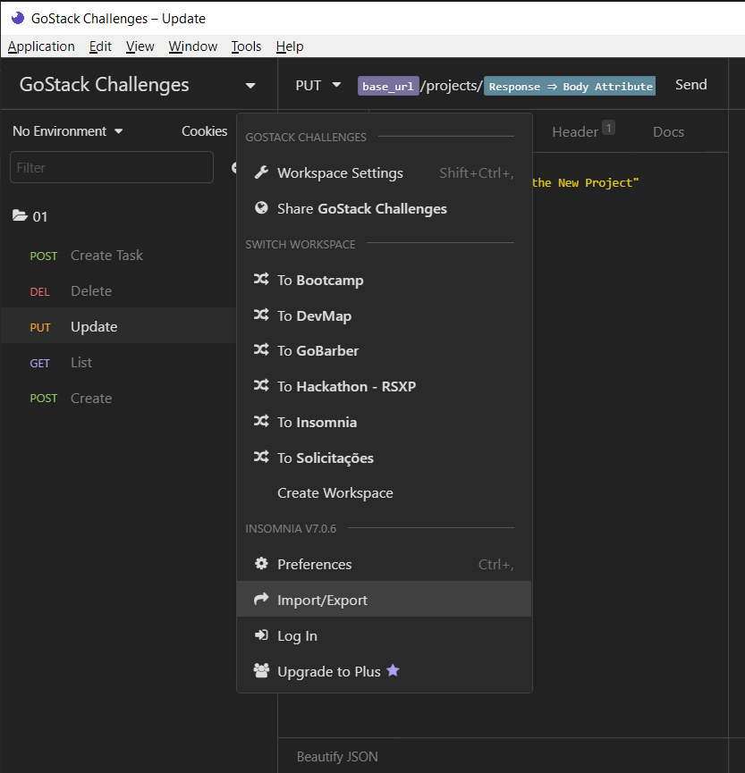
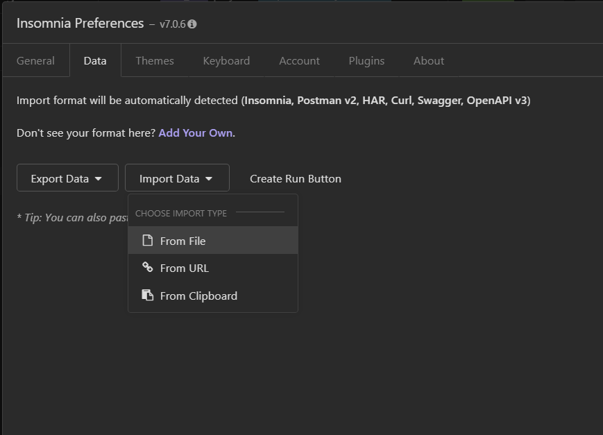

<h1 align="center">
    
</h1>

<h3 align="center">
  Challenge repository
</h3>

“Your only limit is you”!

  
  

  <a href="#nerd_face-import-insomnia-workspace">Import Insomnia Workspace</a>&nbsp;&nbsp;&nbsp;|&nbsp;&nbsp;&nbsp;
  <a href="#muscle-challenges">Challenges</a>&nbsp;&nbsp;&nbsp;|&nbsp;&nbsp;&nbsp;
  <a href="#memo-licença">License</a>

## :nerd_face: Import Insomnia Workspace

1. Click on the arrow down aside the name of your workspace > `Import/Export`

2. Click on `Import Data` > `From File`.

3. Select `insomnia-workspace.json`, in this repo.

4. :tada:

## :muscle: Challenges

1. Challenge 01: [Create an application from scratch to store projects and tasks using Express](https://github.com/vsalbuq/gostack/tree/master/challenge-01#----).

## :memo: Licence

This project is under MIT License. Read [LICENSE](LICENSE.md) for detailed info.
